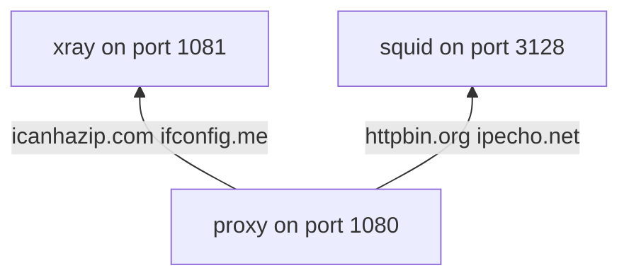

# README

This repo is used to reproduce the issue xray does not work with squid outbound proxy. I setup the following environment to test. The service list comes from <https://stackoverflow.com/questions/30385254/getting-my-servers-requesting-ip-address-from-an-outgoing-curl-request>

The topology are



- If the user access `icanhazip.com` or `ifconfig.me`, `proxy` will use `xray`
- If the user access `httpbin.org` or `ipecho.net`, `proxy` will use `squid`

```sh
# Use squid direct
curl --proxy http://localhost:3128 -Lv http://httpbin.org/get

# Use xray direct
curl --proxy http://localhost:1081 -Lv http://httpbin.org/get

# proxy using squid fails
curl --proxy http://localhost:1080 -Lv http://httpbin.org/get

# proxy using xray succeed
curl --proxy http://localhost:1080 -Lv http://ifconfig.me
```

For `curl --proxy http://localhost:1080 -Lv http://httpbin.org/get`, I found the following

```text
1734059326.941      1 172.30.0.4 TCP_DENIED_ABORTED/403 316 CONNECT httpbin.org:80 - HIER_NONE/- text/html
1734059326.942      1 172.30.0.4 TCP_DENIED_ABORTED/403 316 CONNECT httpbin.org:80 - HIER_NONE/- text/html
1734059327.049      3 172.30.0.4 TCP_DENIED_ABORTED/403 316 CONNECT httpbin.org:80 - HIER_NONE/- text/html
1734059327.257      4 172.30.0.4 TCP_DENIED_ABORTED/403 316 CONNECT httpbin.org:80 - HIER_NONE/- text/html
1734059327.564      4 172.30.0.4 TCP_DENIED_ABORTED/403 316 CONNECT httpbin.org:80 - HIER_NONE/- text/html
```

## How to use

Run `docker compose down -v; docker compose up -d` and it require the following packages on Ubuntu

- `docker.io`
- `docker-compose-v2`